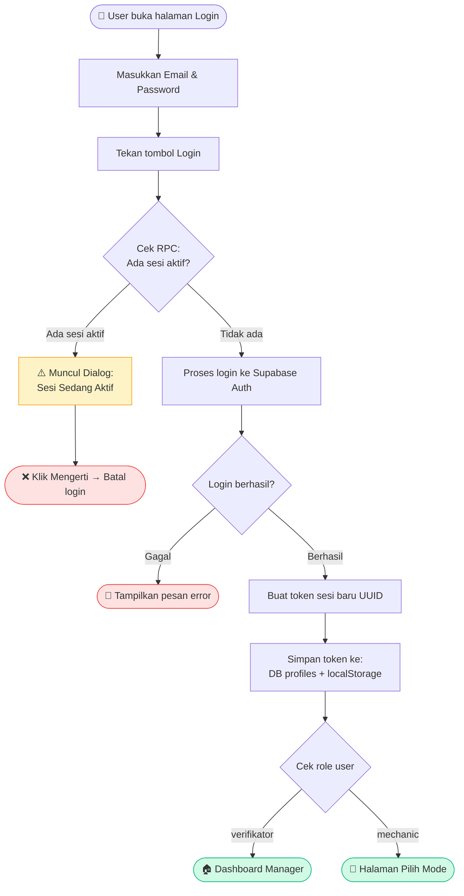
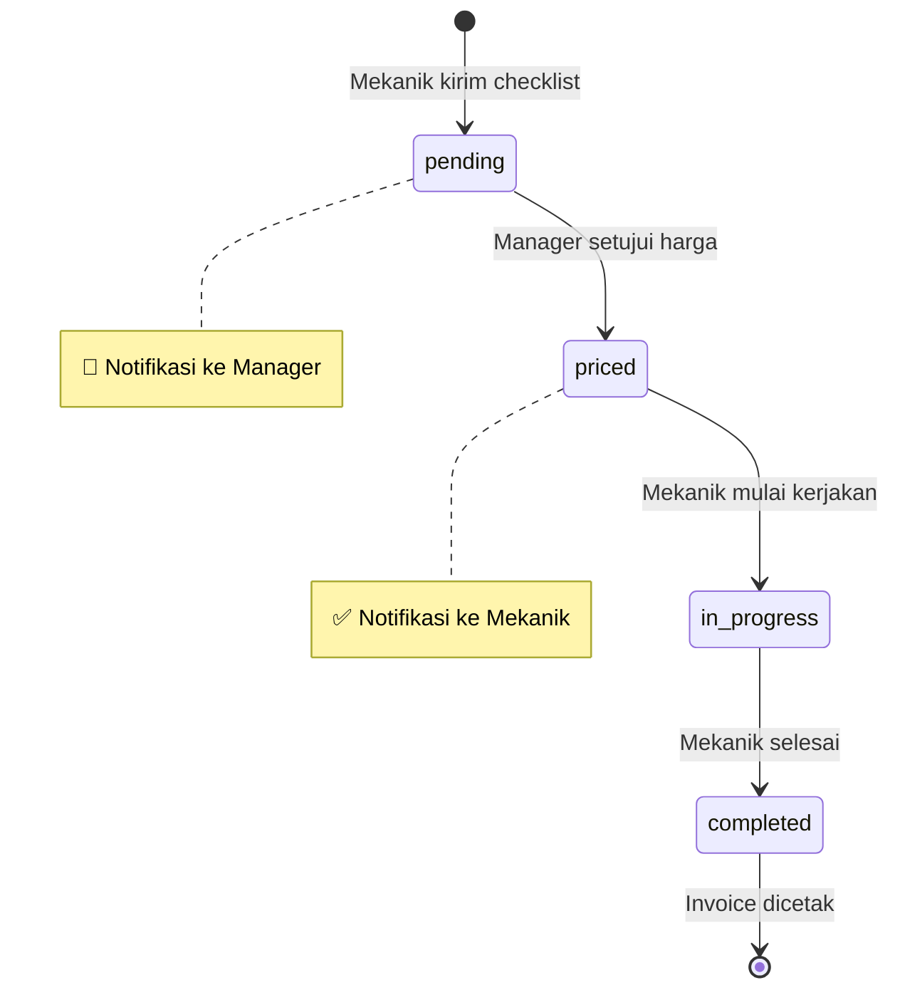
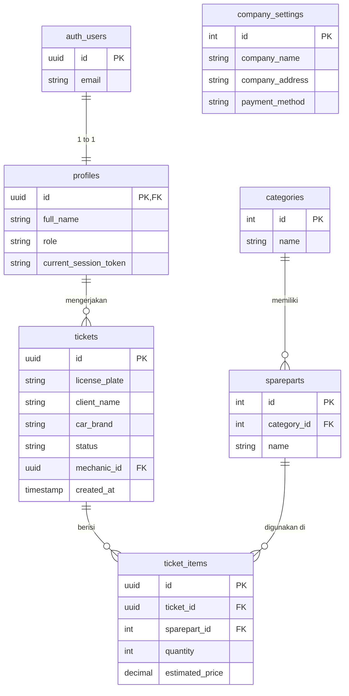
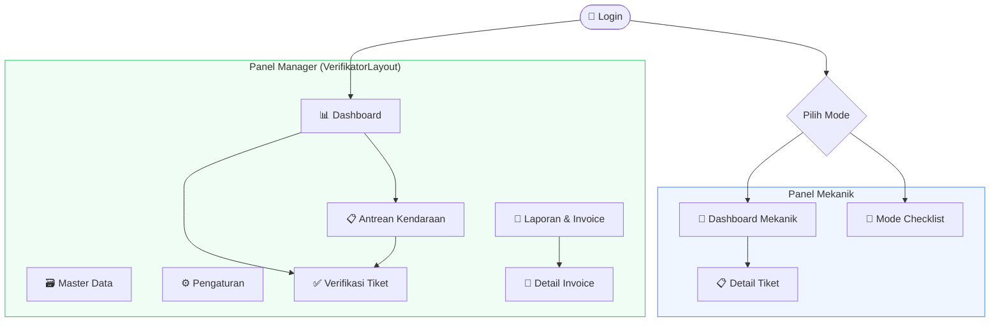
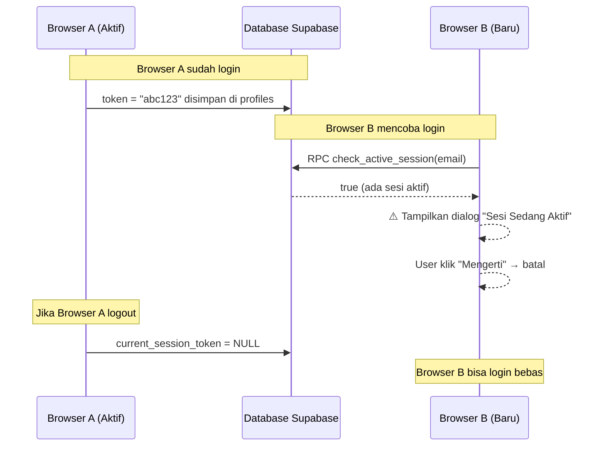

# 📊 Diagram Aplikasi Workshop Management

## 1. Alur Login & Single Session

---

## 2. Alur Kerja Tiket Kendaraan

```mermaid
flowchart LR
    subgraph MEKANIK["🔧 Mekanik"]
        A[Terima kendaraan] --> B[Isi Checklist\nsparepart & pekerjaan]
        B --> C[Kirim ke Manager]
    end

    subgraph MANAGER["👔 Manager / Verifikator"]
        D[Terima notifikasi\ntiket baru 🔔] --> E[Buka & periksa\ndetail tiket]
        E --> F[Setujui harga\ntiket → status: priced]
    end

    subgraph MEKANIK2["🔧 Mekanik - Pengerjaan"]
        G[Terima notifikasi\npersetujuan ✅] --> H[Mulai pengerjaan\nstatus: in_progress]
        H --> I[Pengerjaan selesai\nstatus: completed]
    end

    subgraph MANAGER2["👔 Manager - Invoice"]
        J[Buka laporan] --> K[Cetak / lihat\nInvoice PDF]
    end

    C -->|Realtime| D
    F -->|Realtime| G
    I --> J

    style MEKANIK fill:#eff6ff,stroke:#3b82f6
    style MANAGER fill:#f0fdf4,stroke:#22c55e
    style MEKANIK2 fill:#eff6ff,stroke:#3b82f6
    style MANAGER2 fill:#f0fdf4,stroke:#22c55e
```

---

## 3. Status Tiket

---

## 4. Struktur Database

---

## 5. Arsitektur Halaman Aplikasi

---

## 6. Keamanan Sesi Real-time

